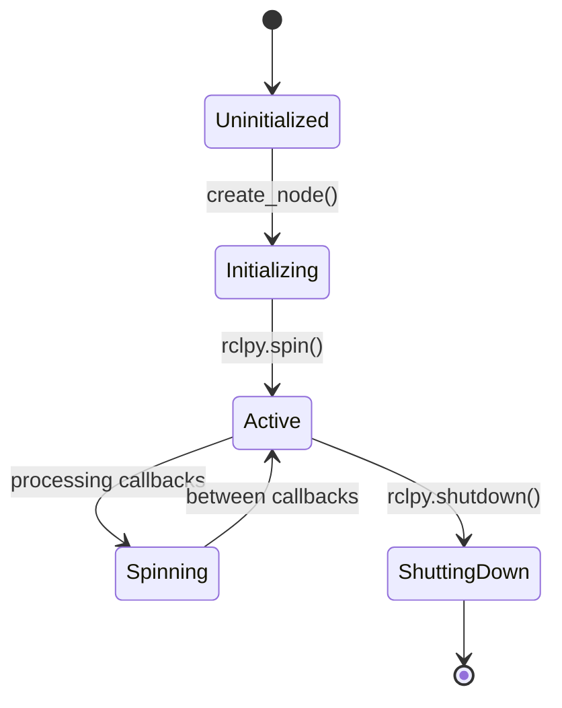

# Nodes and Topics

This module covers creating and managing nodes and topics in ROS 2, the fundamental building blocks of robotic applications.

## Creating a Node

A ROS 2 node is an executable that uses ROS client libraries to communicate with other nodes.

### Basic Node Structure

```python
import rclpy
from rclpy.node import Node

class MyNode(Node):
    def __init__(self):
        super().__init__('node_name')
        # Initialize node components here

def main(args=None):
    rclpy.init(args=args)
    node = MyNode()
    rclpy.spin(node)
    node.destroy_node()
    rclpy.shutdown()

if __name__ == '__main__':
    main()
```

## Topics and Publishers/Subscribers

### Publishers
Publishers send data to topics. Multiple subscribers can listen to the same topic.

### Subscribers
Subscribers receive data from topics. They register a callback function that processes incoming messages.

## Mermaid.js Diagram: Node Lifecycle and Execution Model



## Python Code Snippet: Creating a Custom ROS 2 Node with Publishers and Subscribers

```python
import rclpy
from rclpy.node import Node
from std_msgs.msg import String
from geometry_msgs.msg import Twist

class RobotController(Node):
    def __init__(self):
        super().__init__('robot_controller')

        # Create publisher for velocity commands
        self.cmd_vel_publisher = self.create_publisher(Twist, 'cmd_vel', 10)

        # Create subscriber for sensor data
        self.sensor_subscriber = self.create_subscription(
            String,
            'sensor_data',
            self.sensor_callback,
            10
        )

        # Timer for periodic control updates
        self.timer = self.create_timer(0.1, self.control_loop)
        self.get_logger().info('Robot Controller node initialized')

    def sensor_callback(self, msg):
        self.get_logger().info(f'Received sensor data: {msg.data}')
        # Process sensor data and update control strategy

    def control_loop(self):
        # Generate control commands based on current state
        cmd_vel = Twist()
        cmd_vel.linear.x = 0.5  # Move forward at 0.5 m/s
        cmd_vel.angular.z = 0.0  # No rotation
        self.cmd_vel_publisher.publish(cmd_vel)

def main(args=None):
    rclpy.init(args=args)
    robot_controller = RobotController()

    try:
        rclpy.spin(robot_controller)
    except KeyboardInterrupt:
        pass
    finally:
        robot_controller.destroy_node()
        rclpy.shutdown()

if __name__ == '__main__':
    main()
```

## Quality of Service (QoS) Settings

QoS settings control how messages are delivered:
- **Reliability**: Best effort or reliable delivery
- **Durability**: Volatile or transient local
- **History**: Keep all or keep last N messages
- **Depth**: Number of messages to store

## Best Practices

- Use descriptive node and topic names
- Implement proper error handling
- Use appropriate QoS settings for your application
- Clean up resources properly in destroy_node()

## Next Steps

Continue to the next lesson to learn about URDF basics for robot modeling.