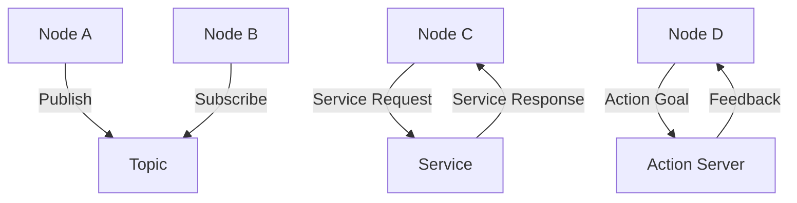

# ROS 2 Architecture

This module introduces the fundamental architecture of ROS 2, the middleware that connects the robot's brain to its body.

## Architecture Overview

ROS 2 follows a distributed architecture based on the Data Distribution Service (DDS) standard, providing:

- **Nodes**: Independent processes that perform computation
- **Topics**: Communication channels for streaming data
- **Services**: Request/response communication patterns
- **Actions**: Goal-oriented communication with feedback

## Key Concepts Using Biological Analogies

### Nodes as Neurons
Like neurons in a nervous system, nodes are the basic computational units that process information. Each node runs in its own process and can communicate with other nodes.

### Topics as Synapses
Topics function like synapses, allowing nodes to exchange information through publish/subscribe patterns. Multiple nodes can subscribe to the same topic, just as multiple neurons can receive signals from one source.

### Services as Direct Communication
Services represent direct communication pathways, similar to direct neural connections where a specific request requires a specific response.

## Core Components

### DDS Implementation
ROS 2 uses DDS (Data Distribution Service) as the underlying communication middleware, providing:
- Real-time performance
- Deterministic behavior
- Quality of Service (QoS) settings
- Language independence

### Execution Model
- **Single-threaded executor**: Processes callbacks sequentially
- **Multi-threaded executor**: Processes callbacks in parallel
- **Static executor**: Custom thread management

## Mermaid.js Diagram: ROS 2 Communication Architecture



## Python Code Snippet: Basic Publisher/Subscriber Pattern

```python
import rclpy
from rclpy.node import Node
from std_msgs.msg import String

class MinimalPublisher(Node):
    def __init__(self):
        super().__init__('minimal_publisher')
        self.publisher_ = self.create_publisher(String, 'topic', 10)
        timer_period = 0.5  # seconds
        self.timer = self.create_timer(timer_period, self.timer_callback)
        self.i = 0

    def timer_callback(self):
        msg = String()
        msg.data = 'Hello World: %d' % self.i
        self.publisher_.publish(msg)
        self.get_logger().info('Publishing: "%s"' % msg.data)
        self.i += 1

class MinimalSubscriber(Node):
    def __init__(self):
        super().__init__('minimal_subscriber')
        self.subscription = self.create_subscription(
            String,
            'topic',
            self.listener_callback,
            10)
        self.subscription  # prevent unused variable warning

    def listener_callback(self, msg):
        self.get_logger().info('I heard: "%s"' % msg.data)

def main(args=None):
    rclpy.init(args=args)
    minimal_publisher = MinimalPublisher()
    minimal_subscriber = MinimalSubscriber()

    rclpy.spin(minimal_publisher)
    rclpy.spin(minimal_subscriber)

    minimal_publisher.destroy_node()
    minimal_subscriber.destroy_node()
    rclpy.shutdown()

if __name__ == '__main__':
    main()
```

## Next Steps

Continue to the next lesson to learn about creating and managing nodes and topics.